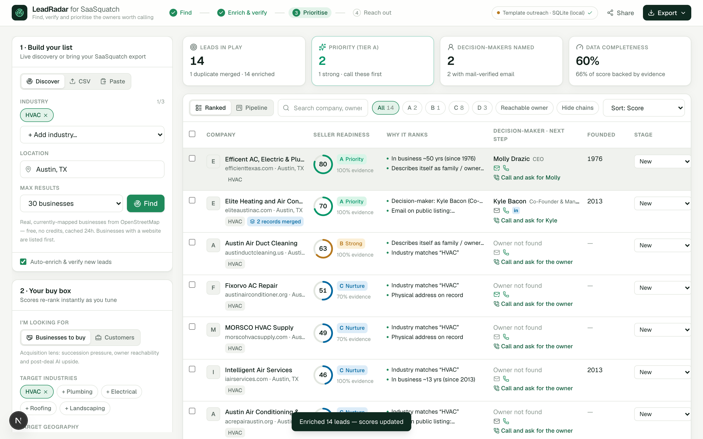
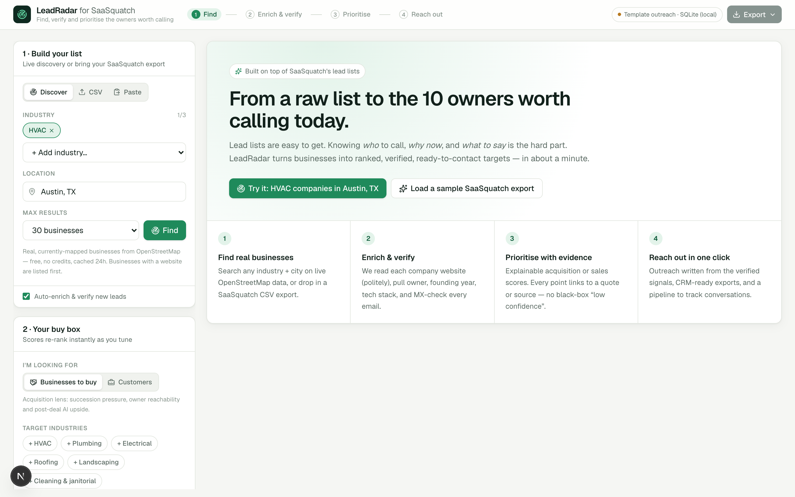
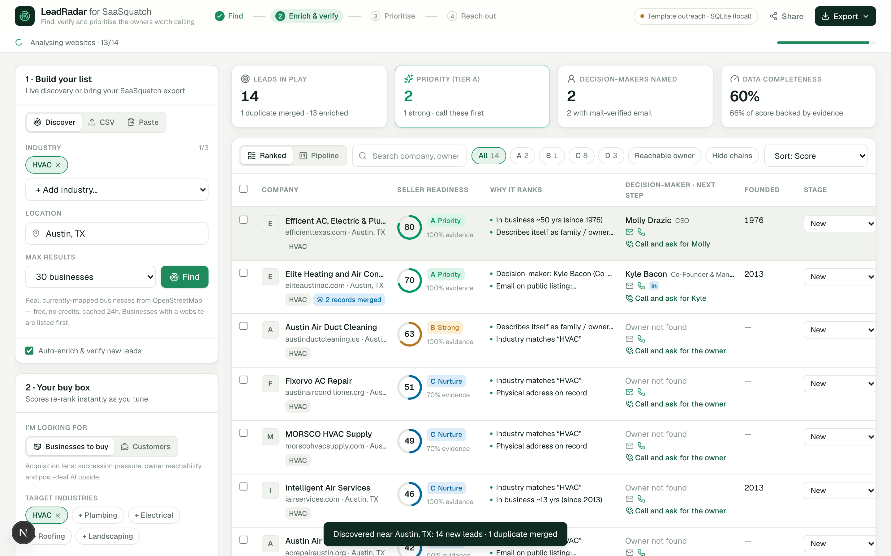
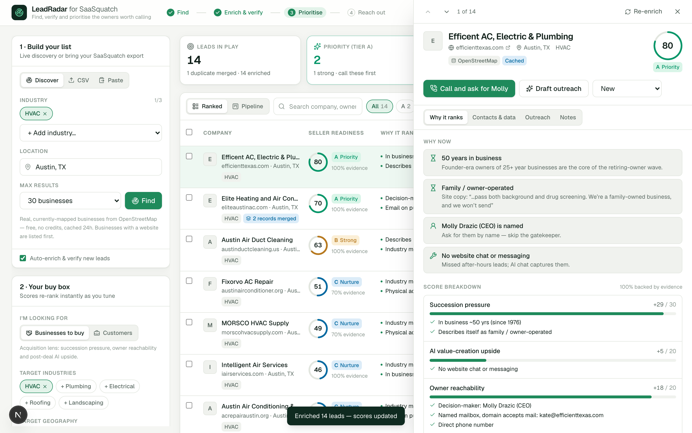
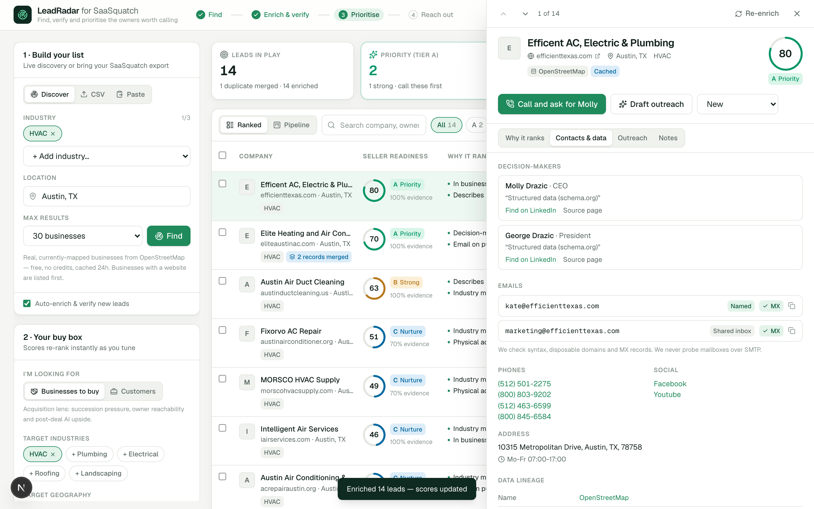
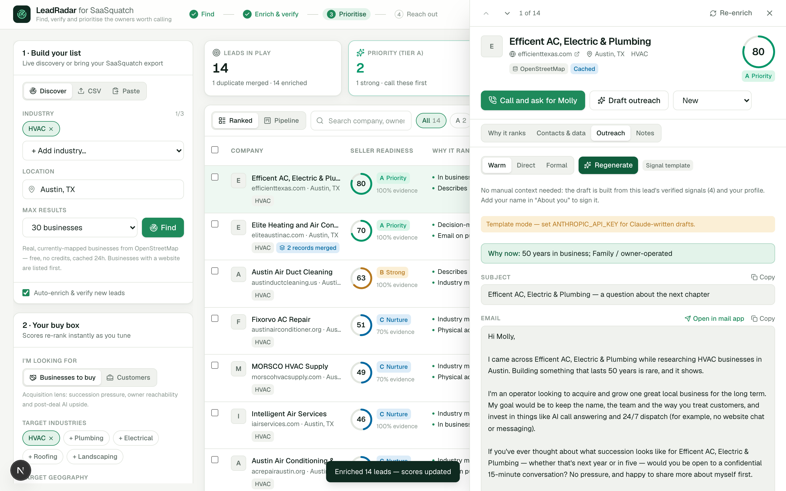
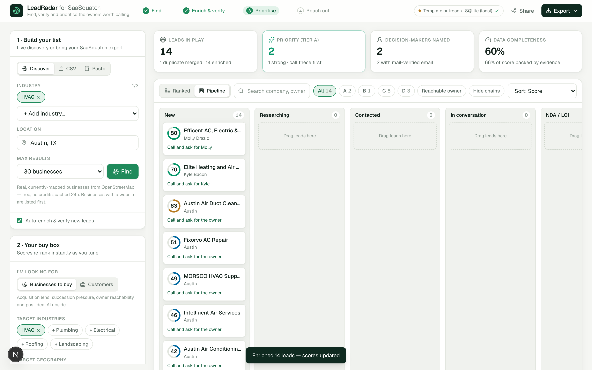
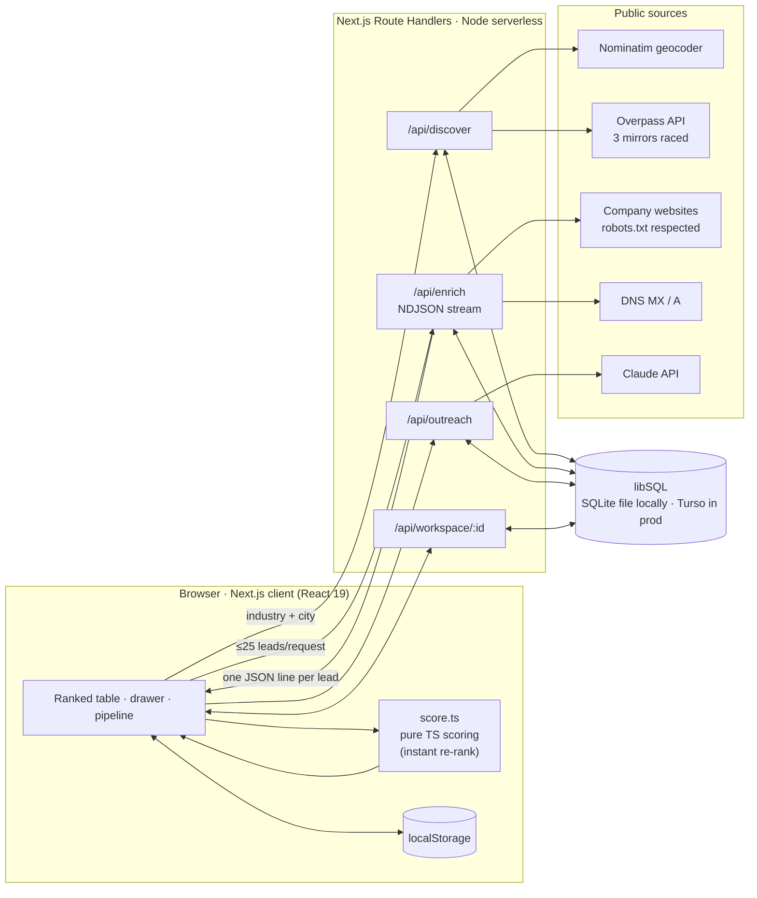

# LeadRadar for SaaSquatch

**Find, verify and prioritise the owners worth calling.**
A quality-first enhancement to [SaaSquatch Leads](https://www.saasquatchleads.com/), built for Caprae Capital's AI-Readiness pre-screening challenge.

> SaaSquatch is great at producing lists. LeadRadar answers the next three questions every searcher and sales rep asks: **who do I call first, why now, and what do I say?**



---

## 1. What I studied and what I changed

I downloaded SaaSquatch's public product walkthrough and reviewed it frame by frame, together with the marketing site and product pages.

| SaaSquatch today (from the demo) | Pain for the user | LeadRadar |
|---|---|---|
| Company Finder: industry + location → a table of Company, Industry, Address, BBB, Phone, Website, Estimated Revenue. Many cells show **N/A**. The search takes minutes. | Lots of rows, little you can act on. No ranking. | **Live discovery** from OpenStreetMap (≈2 s, cached). Results stream in and are **enriched and verified automatically**. Every lead is ranked. |
| "Estimated Revenue" comes with a **Low / Medium confidence** badge but no explanation. | You can't trust or defend the number. | Revenue is a **range with its method shown** (e.g. "12 staff, from the site's own copy × HVAC revenue-per-employee benchmark"). If there's no signal, it says so instead of guessing. |
| Data Enhancement is a separate page: tick companies, then click "Start Enrichment". | Extra steps, and you have to know to use it. | Enrichment runs automatically on import and discovery, with a progress bar. You can re-enrich any lead. |
| Email Generator requires **three hand-written context points of 20+ words each**. | The slowest step in the flow. Reps copy-paste news by hand. | **Zero manual context.** Outreach is built from the lead's verified signals (tenure, family ownership, digital gaps, named owner, hiring). You get an email, cold-call opener, LinkedIn note, 2 follow-ups and talking points. |
| No scoring, dedupe, verification or pipeline. | Duplicates, dead mailboxes, and no idea what to do next. | Explainable **0–100 score + A–D tier**, cross-source **dedupe**, **MX-verified** emails, **next best action**, **pipeline board**, **HubSpot / Salesforce exports**, shareable **pipeline brief**. |

**Why this matters for Caprae specifically.** SaaSquatch launched *for acquisition entrepreneurs*. A searcher doesn't need 5,000 contacts. They need the ~20 retiring owners in their buy box who will pick up the phone. So LeadRadar has two lenses:

- **Businesses to buy (acquisition):** succession pressure (years in business, family/generational language), post-acquisition **AI value-creation upside** (no online booking, no analytics, stale site, DIY builder), owner reachability, buy-box fit, proof of operation. **Franchise and chain locations are detected and capped**, because there is no independent owner to buy from.
- **Customers (sales):** buying signals (hiring, missing tooling), reachability, ICP fit, legitimacy.

This mirrors Caprae's thesis that most value is created *after* the acquisition: the upside factor effectively produces a first-pass value-creation plan for each target.

---

## 2. Feature tour

| | |
|---|---|
|  | **Guided start.** A four-step workflow indicator (Find → Enrich & verify → Prioritise → Reach out) and one-click demos. |
|  | **Streaming results.** Leads appear immediately. Each row fills in as its website is analysed, and scores re-rank live. |
|  | **Evidence, not a black box.** Every factor shows the points it contributed, what backs it (✓) and what's missing (⚠). Unknown data is scored conservatively, so thin leads never float to the top. |
|  | **Verified contacts and data lineage.** Named vs shared-inbox emails, MX checks, phones, socials, and the source of every field (OSM link, page crawled, CSV). |
|  | **Outreach pack.** Tone control, "why now", email with *Open in mail app* (auto-logs the touch), call opener, LinkedIn note, follow-ups, talking points. |
|  | **Pipeline.** Drag-and-drop stages from New to NDA/LOI, notes with quick-log chips, bulk actions. |

Also included:
- **Tunable buy box.** Industries, geography, minimum years in business and factor weights; the list re-ranks instantly on the client.
- **Import.** Accepts SaaSquatch CSV exports (their exact column names are auto-mapped; `N/A` is treated as empty; city and state are recovered from the combined address), any CSV with a manual mapping override, or pasted domains/URLs/emails.
- **Exports.** Full intelligence CSV, HubSpot import, Salesforce Leads, an A/B call sheet, a printable **pipeline brief** (self-contained HTML → PDF), and "copy verified emails". All exports are protected against spreadsheet formula injection.
- **Shareable workspaces.** `?w=<id>` links are persisted server-side so a teammate sees the same list, stages and notes.
- **Keyboard flow and layout.** `/` search, `j`/`k` step through leads, `Esc` closes the drawer. Responsive down to 400 px, with light and dark themes.

---

## 3. Architecture



### Stack
| Layer | Choice | Why |
|---|---|---|
| Framework | **Next.js 16 (App Router) + React 19 + TypeScript (strict)** | One deployable. The UI is a static shell and the APIs are Route Handlers. |
| Styling | **Tailwind CSS v4** with CSS-variable design tokens (light and dark), Geist font, lucide icons | A consistent, themeable system with no component-library weight. |
| Scraping | Native `fetch` + **Cheerio**, a custom RFC 9309 robots.txt parser | Fast, serverless-friendly, no headless browser to cold-start. |
| Discovery | **OpenStreetMap**: Nominatim (geocode) + Overpass (businesses by tag) | Real, open (ODbL), free data with website, phone and email tags. No credits. |
| Verification | Node `dns` MX with an A-record fallback, syntax, disposable and freemail lists | Catches dead domains without abusive SMTP probing. |
| Dedupe | Union-find over domain, E.164 phone, and fuzzy name (Sørensen–Dice ≥ 0.9) within the same city | Merges transitive duplicates across OSM, CSV and pasted sources. |
| AI | **Claude (`claude-opus-5`)** via `@anthropic-ai/sdk` structured outputs (Zod), low effort | Schema-valid drafts, grounded only in provided facts. A deterministic template is used when there is no key. |
| Storage | **libSQL**: SQLite file locally, **Turso** in production, in-memory fallback | The same SQL and driver everywhere, and it works on serverless. |
| Tests | **Vitest**: 39 unit tests, plus a live end-to-end smoke script and a Playwright screenshot script | |

### Data storage strategy
Everything goes through `src/lib/db.ts`, which has two tables:
- `kv_cache(ns, key, value, expires_at)` is a namespaced TTL cache:
  - `discover`: 24 h, keyed by industries + bounding box
  - `geo`: 30 days (this also respects Nominatim's 1 req/s policy)
  - `enrich`: 7 days per domain
  - `robots`: 24 h
  - `mx`: 7 days
  - `outreach`: 7 days, keyed by lead + signals + tone
- `workspaces(id, data, updated_at)` holds shareable lists (leads, stages, notes, buy box).

The client also mirrors the workspace to `localStorage`, so the app works instantly offline or after a refresh, then syncs to the server with a 1.5 s debounce.

### Caching and performance
- **Two-tier cache.** L1 is an in-process LRU of 1,000 entries; L2 is libSQL/Turso, shared across serverless instances. A warm re-run of an enriched list is effectively instant.
- **Streaming NDJSON.** Time-to-first-result is the fastest website, not the slowest.
- **Bounded concurrency.** Up to 6 sites in parallel, at most 25 leads per request (a client-side batcher chains requests), and at most 3 subpages per site fetched in parallel.
- **Per-page limits.** An 8 s timeout, a 1.5 MB HTML cap, and no http retry after an https timeout.
- **Overpass mirror race.** Three endpoints are staggered 1.5 s apart; the first valid answer wins and the others are aborted.
- **Client-side scoring.** Changing weights, lens or filters re-ranks with zero network calls.

### Hosting and deployment
- **Target:** Vercel. The static UI shell is served from the CDN, and the Route Handlers run as Node serverless functions (`maxDuration = 60`). **Turso** (managed libSQL) is the database, and Vercel's infrastructure runs on AWS.
- **Why serverless:** the workload is bursty (a user runs a search, then reads) and I/O-bound, so pay-per-invocation with a shared cache in Turso fits.
- **Deploy steps:**
  1. `turso db create leadradar` and `turso db tokens create leadradar`.
  2. Import the repo in Vercel (or run `vercel`) and set `TURSO_DATABASE_URL`, `TURSO_AUTH_TOKEN`, and optionally `ANTHROPIC_API_KEY`.
  3. Push to `main`. Vercel builds with `next build` and deploys each push, with a preview for every PR.
- Nothing in the code is Vercel-specific. `next start` in a container (e.g. GCP Cloud Run) works too; set the same environment variables.

---

## 4. Scoring model (acquisition lens defaults)

| Factor | Weight | Signals |
|---|---|---|
| Succession pressure | 30 | Founding year (JSON-LD `foundingDate`, "since 1976", "40 years in business"), family/owner-operated, generational language |
| AI value-creation upside | 20 | No online booking, analytics or chat; DIY site builder; stale © year; not mobile-ready; no HTTPS. Upside is **reduced** when the business already runs ServiceTitan, HubSpot and similar tools. |
| Owner reachability | 20 | Named decision-maker (schema.org founder/employee, "Jane Doe, Owner"), named vs shared mailbox with MX, direct phone, LinkedIn |
| Buy-box fit | 15 | Industry keywords, geography, minimum years. **Capped at 10% for franchise/chain locations** (OSM `brand`, "independently owned and operated") |
| Established & operating | 15 | Live site, address, OSM listing, opening hours, socials, multi-location |

- **Tiers:** A ≥ 70, B ≥ 55, C ≥ 40, D < 40.
- Factors with no data score at a 0.3 prior, and the UI reports **evidence coverage**, the share of the score backed by real data.
- Revenue is shown only when a headcount or locations signal exists, as a range with its method.

---

## 5. Ethics and data quality
- Respects `robots.txt`, uses an honest user agent, crawls at most 4 pages per site, and caches for 7 days to avoid re-hitting sites.
- **CAPTCHA / bot protection and IP blocks are detected and flagged for manual review, never bypassed.** I think that's the correct stance for a product carrying Caprae's name.
- No SMTP mailbox probing and no scraping of personal social profiles. LinkedIn is linked as a search, not scraped.
- Website text is passed to Claude inside a tagged block as **untrusted data**, with instructions to ignore any directives in it.
- Exports are escaped against formula injection, and the brief HTML is fully escaped.
- OpenStreetMap data is © OpenStreetMap contributors (ODbL), and attribution is shown in the app.

---

## 6. Results (live run, Austin TX · HVAC, 12 websites)

```
discover: 15 leads (13 with website) in 1.8s        dedupe: 1 duplicate merged
enrich:   12 sites in 12.4s cold (6 parallel) · ~0.4s warm from cache
  ok      Efficient AC, Electric & Plumbing  founded=1976  people=Molly Drazic (CEO), George Drazic (President)
          emails=kate@efficienttexas.com [named, MX ✓]
  blocked Johnstone Supply / Robert Madden   → flagged, not bypassed
  captcha Goettl Air Conditioning            → flagged, not bypassed
ranking:
  80 A  Efficient AC…   "In business ~50 yrs (since 1976) · family-owned · CEO named"  → Call and ask for Molly
  70 A  Elite Heating…  "Co-Founder Kyle Bacon named · email on listing"             → Call and ask for Kyle
  63 B  Austin Air Duct Cleaning  "family-owned · industry match"                    → Call and ask for the owner
```
The equivalent SaaSquatch table rows for the same companies would show the address, a phone, and "N/A" for most other columns.

---

## 7. Run it locally

```bash
npm install
npm run dev              # http://localhost:3000 (SQLite cache in .data/)
# optional
export ANTHROPIC_API_KEY=...   # Claude-written outreach (template mode otherwise)
npm test                 # 39 unit tests
npm run typecheck && npm run lint
npm run smoke -- hvac "Austin, TX" 12     # live discover → enrich → score in the terminal
npm run make-sample      # regenerate public/sample-saasquatch-export.csv from live data
BASE_URL=http://localhost:3000 node scripts/screenshots.mjs   # drive Chrome, save docs/screenshots
```

Environment variables (all optional):

| Var | Purpose |
|---|---|
| `ANTHROPIC_API_KEY` | Enables Claude outreach drafts |
| `TURSO_DATABASE_URL`, `TURSO_AUTH_TOKEN` | Production database / shared cache |

**Dataset:** `public/sample-saasquatch-export.csv` has 16 real Texas businesses from OpenStreetMap in SaaSquatch's exact export layout, including two planted duplicates (a URL variant and a phone match) to demonstrate dedupe.

## 8. Project layout
```
src/app/api/{discover,enrich,outreach,status,workspace/[id]}   Route Handlers
src/lib/discover.ts   OSM geocode + Overpass mirror race → leads
src/lib/crawler.ts    polite crawl: robots, subpage picking, caching
src/lib/extract.ts    HTML → facts (JSON-LD, founding year, people, tech, franchise…)
src/lib/verify.ts     email syntax / role / freemail / MX
src/lib/dedupe.ts     union-find entity resolution
src/lib/score.ts      explainable lenses, signals, next action, revenue range
src/lib/outreach.ts   Claude structured output + signal template
src/lib/csv.ts        SaaSquatch-aware import; HubSpot/Salesforce/call-sheet export
src/lib/db.ts         libSQL (SQLite/Turso) two-tier cache + workspaces
src/components/*      App shell, source panel, buy box, table, drawer, pipeline, export
tests/*               Vitest unit tests
scripts/*             smoke test, sample generator, screenshot driver
```

## 9. Limitations and next steps
- **JavaScript-only sites** yield fewer signals, because there's no headless browser (a deliberate serverless trade-off). Next step: an optional Playwright worker queue for the top-tier leads only.
- **Owner names are scarce** on small-business sites. Next step: Secretary of State registry lookups (officers and formation date), which would also verify founding year.
- **OSM coverage varies by city.** Next step: add Google Places / Yelp Fusion as licensed sources behind the same `Lead` interface. Dedupe already handles multi-source input.
- **Weights are manual.** Next step: learn weights from pipeline outcomes (which stages leads reach), since LeadRadar already records them.
- **CRM sync** is file-based today. Next step: HubSpot and Salesforce OAuth push using the same field mappings as the exports.
